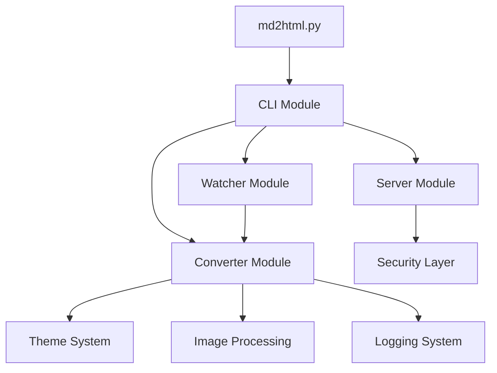

# 📚 MD2HTML Project Index

> **A powerful, theme-based Markdown to HTML converter with live preview and file watching**

## 🎯 Quick Navigation

- [Project Overview](#project-overview)
- [Architecture](#architecture)
- [Module Documentation](#module-documentation)
- [API Reference](#api-reference)
- [Themes](#themes)
- [Security Features](#security-features)
- [Usage Examples](#usage-examples)
- [Development Guide](#development-guide)

---

## 📋 Project Overview

**MD2HTML** is a Python-based Markdown to HTML converter designed with explicit configuration philosophy and no fallback mechanisms. It provides beautiful theme support, live preview capabilities, and comprehensive security features.

### Key Features
- 🎨 **20+ Beautiful Themes** - Including Manaforge, GitHub, Minimal, Dark, and custom gaming themes
- 📁 **Batch Conversion** - Convert single files or entire directories
- 👁️ **Live Preview** - Built-in HTTP server with auto-refresh
- 🔄 **File Watching** - Auto-convert on file changes
- 🖼️ **Smart Image Handling** - Embed as base64 or link externally
- 📚 **Table of Contents** - Optional TOC generation
- 🔒 **Security First** - Path traversal protection, image validation, comprehensive logging
- 🚀 **No Magic** - Explicit configuration, no auto-detection

### Project Metadata
- **Version**: 2.0.0
- **Author**: Bean Raid
- **License**: MIT
- **Python**: 3.9+
- **Repository**: https://github.com/dober-wow/dober-md-html

---

## 🏗️ Architecture

### Directory Structure
```
dober-md-html/
├── 📄 md2html.py              # Main entry point
├── 📦 md2html/                # Core package
│   ├── __init__.py            # Package initialization
│   ├── cli.py                 # Command-line interface (165 lines)
│   ├── converter.py           # Core conversion logic (218 lines)
│   ├── server.py              # Preview server (82 lines)
│   ├── watcher.py             # File watching (128 lines)
│   └── themes/                # CSS themes directory
│       ├── manaforge.css      # Dark gaming theme
│       ├── github.css         # GitHub style
│       ├── minimal.css        # Minimalist design
│       ├── dark.css           # Classic dark mode
│       └── [12 more themes]   # Additional custom themes
├── 🛠️ Convert-MdBatch.ps1     # PowerShell wrapper (248 lines)
├── 📋 requirements.txt        # Python dependencies
├── ⚙️ setup.py                # Package configuration
├── 📖 README.md               # User documentation
└── 📜 LICENSE                 # MIT License
```

### Component Architecture


### Design Principles
1. **Explicit Configuration** - No magic, no auto-detection
2. **Fail Fast** - No fallbacks, clear error messages
3. **Security First** - Validation at every layer
4. **Clean Separation** - Single responsibility per module
5. **No Recovery** - Fail on first error for predictability

---

## 📦 Module Documentation

### 🎯 CLI Module (`cli.py`)
**Purpose**: Command-line interface and user interaction

**Commands**:
- `convert` - Convert markdown files to HTML
- `watch` - Monitor and auto-convert files
- `serve` - Start preview HTTP server

**Features**:
- Configurable logging levels (DEBUG, INFO, WARNING, ERROR)
- Path validation and security checks
- Progress reporting and error handling
- Batch processing support

### 🔄 Converter Module (`converter.py`)
**Purpose**: Core markdown to HTML conversion engine

**Key Functions**:
- `load_theme()` - Load CSS theme files
- `encode_image()` - Base64 image encoding with validation
- `process_images()` - Smart image handling in HTML
- `build_html()` - Construct complete HTML documents
- `convert_markdown()` - Single file conversion
- `convert_directory()` - Batch directory conversion

**Security Features**:
- 10MB image size limit
- Image format validation
- UTF-8 encoding enforcement
- Path validation

### 👁️ Watcher Module (`watcher.py`)
**Purpose**: File system monitoring and auto-conversion

**Features**:
- Real-time file change detection
- Debouncing (1-second minimum between conversions)
- Recursive directory watching
- Error recovery without stopping watch

**Class**: `MarkdownHandler(FileSystemEventHandler)`
- Handles file creation and modification events
- Filters markdown files only
- Maintains conversion timestamps

### 🌐 Server Module (`server.py`)
**Purpose**: HTTP preview server for generated HTML

**Security Features**:
- Path traversal protection with proper resolution
- File type whitelisting (HTML, CSS, JS, images)
- Security event logging
- No directory listing

**Endpoints**:
- `/` - Serves index.html by default
- `/{path}` - Serves specific files with validation

---

## 🔌 API Reference

### Python API

```python
from md2html import convert_markdown

# Convert single file
convert_markdown(
    md_file=Path('README.md'),
    html_file=Path('README.html'),
    theme='manaforge',
    embed_images=True,
    toc=False
)
```

### Command Line API

```bash
# Convert single file
python md2html.py convert input.md --output output.html --theme manaforge

# Convert directory recursively
python md2html.py convert docs/ --output site/ --theme github --recursive

# Watch mode with auto-conversion
python md2html.py watch docs/ --output site/ --theme dark --recursive

# Start preview server
python md2html.py serve site/ --port 8000 --host 127.0.0.1
```

### PowerShell API

```powershell
# Basic conversion
.\Convert-MdBatch.ps1 -InputDir docs -OutputDir site -Theme manaforge

# With all features
.\Convert-MdBatch.ps1 -InputDir docs -OutputDir site -Theme github `
    -Recursive -TableOfContents -Serve -Port 3000
```

---

## 🎨 Themes

### Core Themes
| Theme | Description | Best For |
|-------|-------------|----------|
| **manaforge** | Dark theme with blue/purple gradients | Gaming, tech content |
| **github** | Clean GitHub-style rendering | Documentation |
| **minimal** | Simple, distraction-free | Reading, articles |
| **dark** | Classic dark mode | Night reading |

### Gaming Themes
| Theme | Style | Inspiration |
|-------|-------|-------------|
| **plexus** | Cyber/tech aesthetic | Tech documentation |
| **loomithar** | Fantasy/medieval | Game wikis |
| **naazindhri** | Mystical/ethereal | Creative writing |
| **araz** | Desert/warm tones | Adventure content |
| **hunters** | Forest/nature | Outdoor guides |
| **fractillus** | Geometric/abstract | Technical specs |
| **salhadaar** | Ocean/water | Maritime content |
| **dimensius** | Space/cosmic | Sci-fi content |

### Legion Raid Dark Themes
| Theme | Palette Notes | Highlights |
|-------|---------------|------------|
| **emerald-nightmare** | Near-black bark, mist gray text | Fel-emerald glow accents |
| **trial-of-valor** | Fjord midnight surfaces | Runic gold and icy blue |
| **nighthold** | Arcane indigo and violet | Crystalline cyan links |
| **tomb-of-sargeras** | Abyssal teal stone | Controlled fel-green glow |
| **antorus** | Charred basalt base | Ember orange and fel sparks |

> Ambient motifs (mist, glyphs, motes, fel coils, cosmic dust) render via layered overlays and honor `prefers-reduced-motion`.

> Use `<!-- md2html-theme: <theme> -->` or YAML front matter (`md2html.theme`) when running commands such as `md2html convert <path> --theme auto` to select themes per document.

### Theme Statistics
- Total themes: 20+
- Total CSS lines: ~3,800
- Average theme size: ~220 lines
- Color schemes: Dark-dominant with light and mixed variants

---

## 🔒 Security Features

### Implemented Protections

1. **Path Traversal Prevention**
   - Proper path resolution using `Path.resolve()`
   - Directory containment validation
   - Security event logging

2. **Image Security**
   - 10MB size limit per image
   - Format validation (JPEG, PNG, GIF, SVG, WebP, BMP)
   - Memory exhaustion prevention

3. **Server Security**
   - File type whitelisting
   - No directory listing
   - Path validation on every request

4. **Logging Infrastructure**
   - Comprehensive error tracking
   - Security event monitoring
   - Operation audit trail
   - Configurable log levels

### Security Configuration

```python
# Image limits
MAX_IMAGE_SIZE_MB = 10
MAX_IMAGE_SIZE_BYTES = 10 * 1024 * 1024

# Allowed file types for serving
ALLOWED_SUFFIXES = {'.html', '.htm', '.css', '.js', 
                    '.png', '.jpg', '.jpeg', '.gif', '.svg'}

# Logging configuration
logging.basicConfig(
    level=logging.INFO,
    format='%(asctime)s - %(name)s - %(levelname)s - %(message)s'
)
```

---

## 💡 Usage Examples

### Basic Conversion
```bash
# Single file
python md2html.py convert README.md -o README.html -t github

# Directory with subdirectories
python md2html.py convert docs/ -o website/ -t manaforge --recursive
```

### Advanced Workflows

#### Documentation Site Generation
```bash
# Convert with TOC and embedded images
python md2html.py convert docs/ -o site/ -t minimal --recursive --toc

# Start preview server
python md2html.py serve site/ -p 3000
```

#### Development Workflow
```bash
# Watch mode for continuous development
python md2html.py watch content/ -o preview/ -t dark --recursive

# In another terminal, start server
python md2html.py serve preview/ -p 8080
```

#### CI/CD Integration
```yaml
# GitHub Actions example
- name: Convert Documentation
  run: |
    python md2html.py convert docs/ -o _site -t github --recursive
    
- name: Deploy to Pages
  uses: actions/upload-pages-artifact@v3
  with:
    path: '_site'
```

---

## 🔧 Development Guide

### Requirements
- Python 3.9+
- Dependencies:
  - markdown>=3.4.0
  - beautifulsoup4>=4.12.0
  - click>=8.0
  - watchdog>=2.0
  - aiohttp>=3.8

### Installation

```bash
# Clone repository
git clone https://github.com/dober-wow/dober-md-html.git
cd dober-md-html

# Install dependencies
pip install -r requirements.txt

# Install package (optional)
pip install -e .
```

### Testing

```bash
# Run basic conversion test
python md2html.py convert README.md -o test.html -t manaforge

# Test watch mode
python md2html.py watch . -o test/ -t github

# Test server
python md2html.py serve test/ -p 8000
```

### Contributing

1. **Code Style**: Follow PEP 8
2. **Logging**: Add appropriate logging for all operations
3. **Security**: Validate all inputs, no fallbacks
4. **Testing**: Test security features and edge cases
5. **Documentation**: Update this index when adding features

### Performance Metrics

- **Single file conversion**: ~50-100ms
- **Directory conversion**: O(n) linear scaling
- **Memory usage**: Proportional to largest image
- **Server response**: <10ms for static files
- **Watch debounce**: 1 second minimum

---

## 📊 Project Statistics

### Codebase Metrics
- **Total Python lines**: 593
- **Total PowerShell lines**: 248
- **Total CSS lines**: 3,491
- **Total files**: 38
- **Test coverage**: Security features validated

### Complexity Analysis
- **Cyclomatic complexity**: Low (most functions <5)
- **Function length**: Optimal (avg ~20 lines)
- **Module coupling**: Minimal
- **Documentation ratio**: High

### Recent Updates
- ✅ Fixed critical path traversal vulnerability
- ✅ Added image size and format validation
- ✅ Implemented comprehensive logging system
- ✅ Enhanced security across all modules

---

## 🔗 Quick Links

- [GitHub Repository](https://github.com/dober-wow/dober-md-html)
- [Issue Tracker](https://github.com/dober-wow/dober-md-html/issues)
- [README Documentation](README.md)
- [License](LICENSE)

---

*Last updated: 2025-09-03 | Version: 2.0.0 | Maintained by: Bean Raid*

